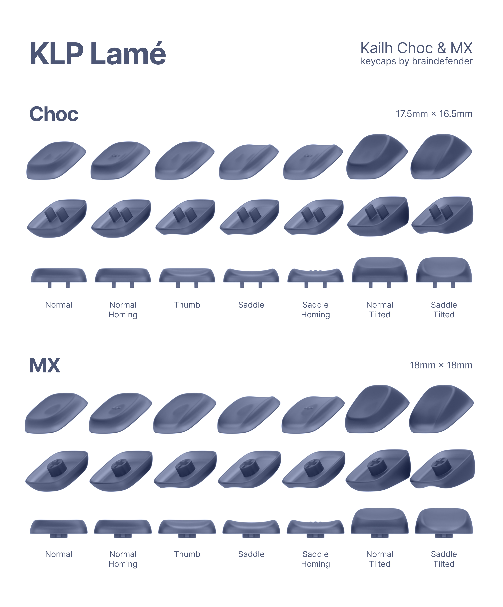
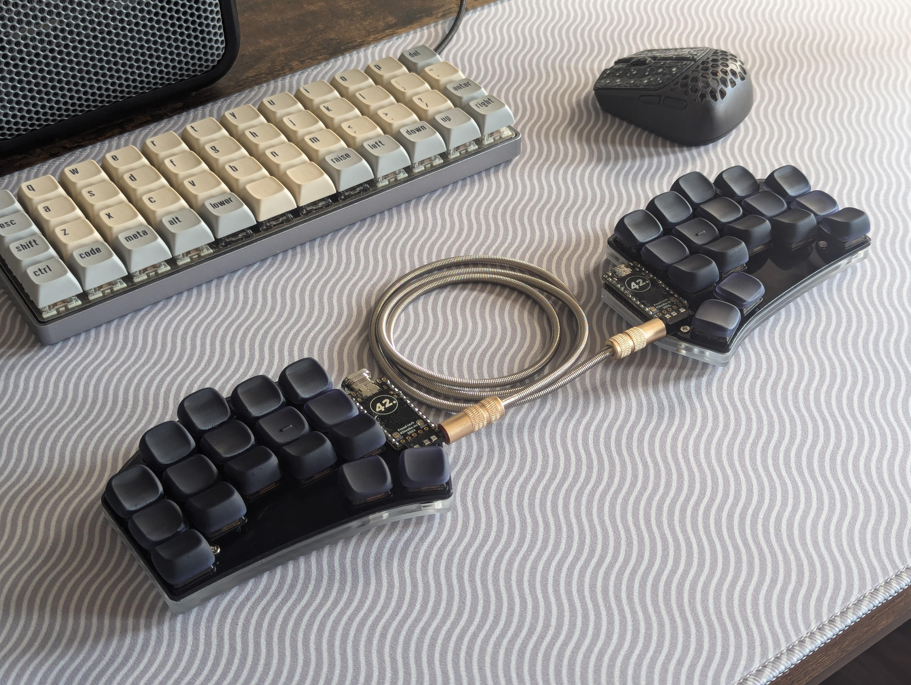
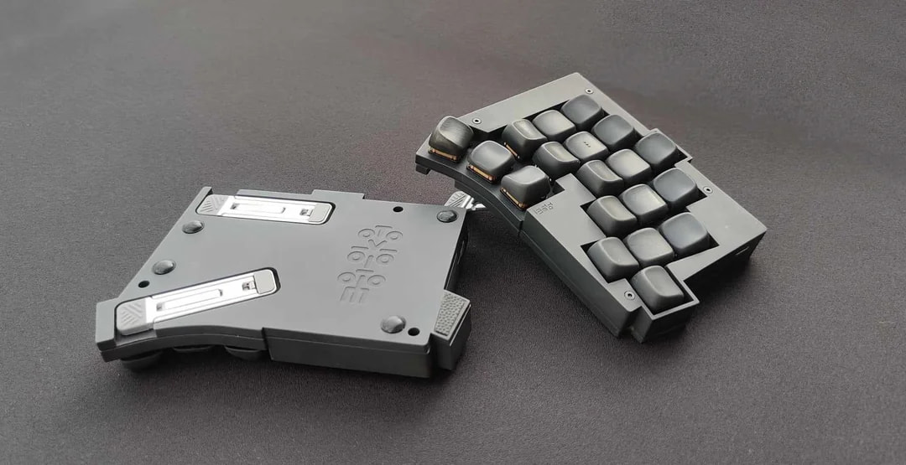
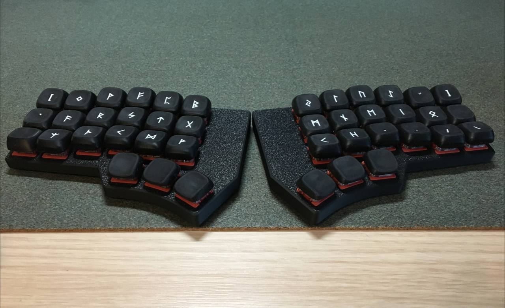
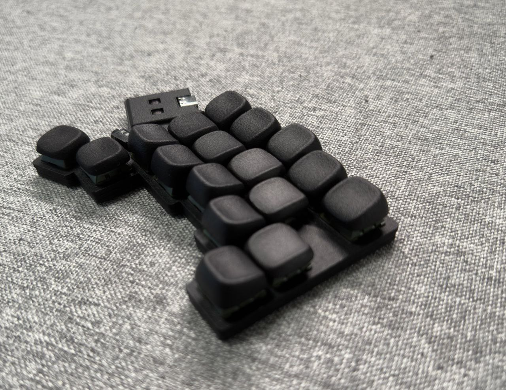

# KLP Lamé — Kailh Choc & MX Keycaps

Sculpted and curved keycaps for Kailh Choc and MX switches. Here is a project structure:

| Folder              | Description                                                                                    |
| :------------------ | :--------------------------------------------------------------------------------------------- |
| **Assets**          | Various images and actual photos of keycaps                                                    |
| **Blender**         | Blender files for [Combined Versions](#how-to-print) and rendering preview image               |
| **Fusion 360**      | Source files for [Autodesk Fusion 360](https://www.autodesk.com/products/fusion-360/overview)  |
| **Lychee (Legacy)** | Project files for [Lychee Slicer](https://mango3d.io/). Use it only for the supports reference |
| **STL**             | 3D models for any CAD of Slicer software                                                       |

There are currently 7 variants of keycaps:
| Variant           | Description                                                                         |
| :---------------- | :---------------------------------------------------------------------------------- |
| **Normal**        | Just a flat keycap profile with a small recess, that is soothing for fingers        |
| **Normal Tilted** | Same as Normal, but top profile has a 15° tilt and 0.5mm upward height compensation |
| **Normal Homing** | Has three little bumps that is useful to determine home positions                   |
| **Thumb**         | Same as Normal, but top profile has a cut along down side                           |
| **Saddle**        | Same as Thumb, but top profile has two symmetrical cuts                             |
| **Saddle Tilted** | Tilted version of Saddle. Same 15° and height compensation                          |
| **Saddle Homing** | Has three little bumps that is useful to determine home positions                   |

## What keycaps do I need for my keyboard?

First, you should pick Choc or MX stem variant. Then, for keycap set there are some variants that depends entirely of your choice.

For corne-like keyboards with 36-keys I use:

| Amount | Kind          | Purpose                     |
| -----: | :------------ | :-------------------------- |
|     20 | Saddle Tilted | For top and bottom rows     |
|     16 | Saddle        | For home row + 6 for thumbs |

or

| Amount | Kind          | Purpose                 |
| -----: | :------------ | :---------------------- |
|     20 | Normal Tilted | For top and bottom rows |
|     10 | Normal        | For home row            |
|      6 | Thumb         | For thumbs              |

## How to print?

It is best to position the model more vertically to avoid tactile layer-to-layer bumps. Personally, I use 45° or 75° angle, but it's up to you.

`STL/Choc-Combined` and `STL/MX-Combined` contains files that you can use in any 3D-printing service like [JLCPCB](https://3d.jlcpcb.com/3d-printing/stereolithography) or [PCBWay](https://www.pcbway.com/rapid-prototyping/3d-printing/). You can download them directly using links below:

| File          | Choc                           | MX                           |
|:--------------|:-------------------------------|:-----------------------------|
| Normal Part 1 | [Download][normal-part-1-choc] | [Download][normal-part-1-mx] |
| Normal Part 2 | [Download][normal-part-2-choc] | [Download][normal-part-2-mx] |
| Saddle Part 1 | [Download][saddle-part-1-choc] | [Download][saddle-part-1-mx] |
| Saddle Part 2 | [Download][saddle-part-2-choc] | [Download][saddle-part-2-mx] |

[normal-part-1-choc]: ./STL/Choc-Combined/KLP_Lame_Normal-6xNormal_Tilted-3xNormal-Combined.7z
[normal-part-1-mx]: ./STL/MX-Combined/KLP_Lame_MX-Normal-6xNormal_Tilted-3xNormal-Combined.7z
[normal-part-2-choc]: ./STL/Choc-Combined/KLP_Lame_Normal-4xNormal_Tilted-3xThumb-1xNormal_Homing-1xNormal-Combined.7z
[normal-part-2-mx]: ./STL/MX-Combined/KLP_Lame_MX-Normal-4xNormal_Tilted-3xThumb-1xNormal_Homing-1xNormal-Combined.7z
[saddle-part-1-choc]: ./STL/Choc-Combined/KLP_Lame_Saddle-6xSaddle_Tilted-3xSaddle-Combined.7z
[saddle-part-1-mx]: ./STL/MX-Combined/KLP_Lame_MX-Saddle-6xSaddle_Tilted-3xSaddle-Combined.7z
[saddle-part-2-choc]: ./STL/Choc-Combined/KLP_Lame_Saddle-4xSaddle_Tilted-4xSaddle-1xSaddle_Homing-Combined.7z
[saddle-part-2-mx]: ./STL/MX-Combined/KLP_Lame_MX-Saddle-4xSaddle_Tilted-4xSaddle-1xSaddle_Homing-Combined.7z

**Normal Part 1**:
- 6 × Normal Tilted
- 3 × Normal

**Normal Part 2**:
- 4 × Normal Tilted
- 3 × Thumb
- 1 × Normal Homing
- 1 × Normal

**Saddle Part 1**:
- 6 × Saddle Tilted
- 3 × Saddle

**Saddle Part 2**:
- 4 × Saddle Tilted
- 4 × Saddle
- 1 × Saddle Homing

> Warning! Lychee project files are deprecated and should be used only as example of making supports. Better to use the original STL files instead.

## Can I use these models for a production and sale?

Yes. But you must leave a mention of this repository/author to end users.

## Can I modify, fork, post (or whatever) these models?

Yes. Rules are the same. Give a credit to the author.

## Changelog

v1.1

- [Models] Added chamfers along inner bottom line (1.2mm for Choc and 1.4mm for MX).
- [Project] Added separate Fusion project files
- [Project] Changed Images & Photos

> Now the models are also suitable for FDM 3D Printers. But I still recommend using SLA for the best quality.

v1.0

- Initial Release

## Images & Photos

### Original photos

> The keyboard is [Cantor Remix](https://github.com/nilokr/cantor-remix)

### From various awesome people

By [u/socopopes](https://www.reddit.com/user/socopopes/) from [Reddit](https://www.reddit.com/r/ErgoMechKeyboards/comments/1dx9d7j/down_14_more_keys_only_34_more_to_go/)

By [u/bert_plasschaert](https://www.reddit.com/user/bert_plasschaert/) from [Reddit](https://www.reddit.com/r/ErgoMechKeyboards/comments/1dmirsg/totem_tenting_bottom_plate/)

By [proostas](https://t.me/proostas) from [Ergonaut Keyboards Ru](https://t.me/ergonautkb_ru)

By unknown from [KlavaOrgWork](https://t.me/klavaorgwork)

## Contacts

@braindefender almost anywhere
