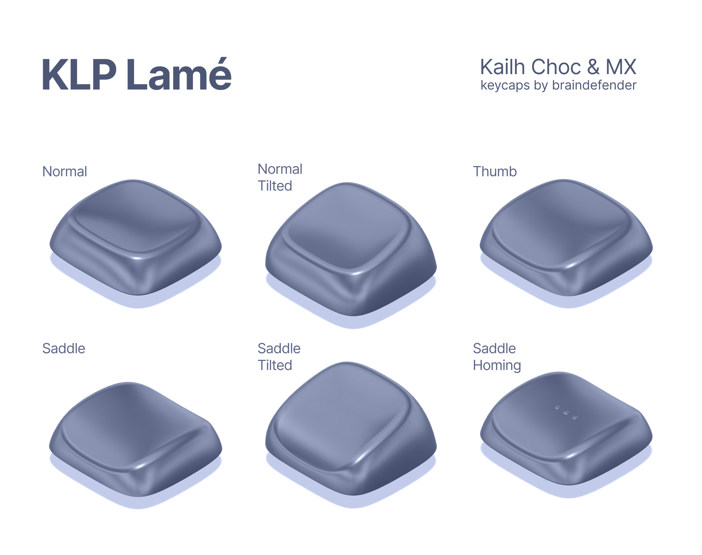
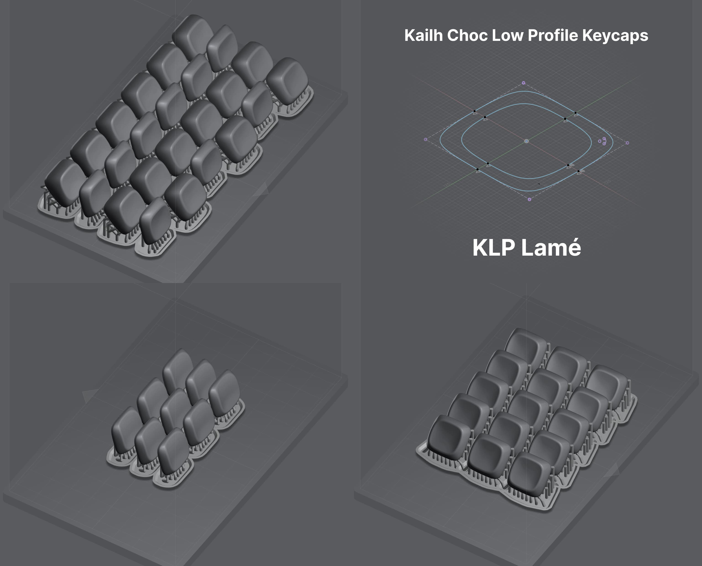

# KLP Lamé — Kailh Low Profile Keycaps

The repository contains these folders:

- **Fusion 360** – source files for [Autodesk Fusion 360](https://www.autodesk.com/products/fusion-360/overview).
- **STL** – 3D models for any CAD of Slicer software.
- **Lychee** – project files for [Lychee Slicer](https://mango3d.io/). You might need to update model paths to edit files.
- **CTB (Mars 2 Pro)** – print-ready files for [Elegoo Mars 2 Pro](https://www.elegoo.com/collections/mars-series/products/elegoo-mars-2-pro-mono-lcd-3d-printer) and Elegoo water-washable resin.
- **Assets** – folder that contain images and actual photos of keycaps.

There are six variants of keycaps:

- **Normal**. Just a flat keycap profile with a small recess, that is soothing for fingers.
- **Normal Tilted**. Same as Normal, but top profile has a 15° tilt and 0.5mm upward height compensation.
- **Normal Homing**. Has three little bumps that is useful to determine home positions.
- **Thumb**. Same as Normal, but top profile has a cut along down side.
- **Saddle**. Same as Thumb, but top profile has two symmetrical cuts.
- **Saddle Tilted**. Tilted version of Saddle. Same 15° and height compensation.
- **Saddle Homing**. Has three little bumps that is useful to determine home positions.

## How to print?

It is best to position the model more vertically to avoid tactile layer-to-layer bumps.

> Personally, I use 45° or 75° angle, but it's up to you.

## Warning

It's better to use original STL files instead of Lychee project files as it contains my settings for my particular printer. Use them as an example of making supports and tune them to achieve best quality for your setup.

## Can I use these models for a production and sale?

Yes. But you must leave a mention of this repository/author to end users.

## Can I modify, fork, post (or whatever) these models?

Yes. Rules are the same. Give a credit to the author.

## Images & Photos

> The keyboard is [Cantor Remix](https://github.com/nilokr/cantor-remix)

## Contacts

@braindefender almost anywhere
