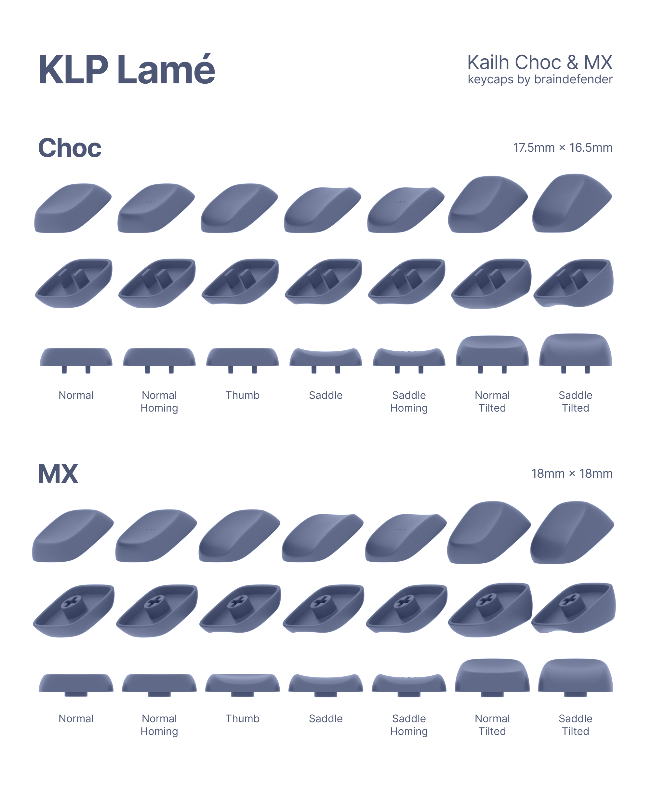
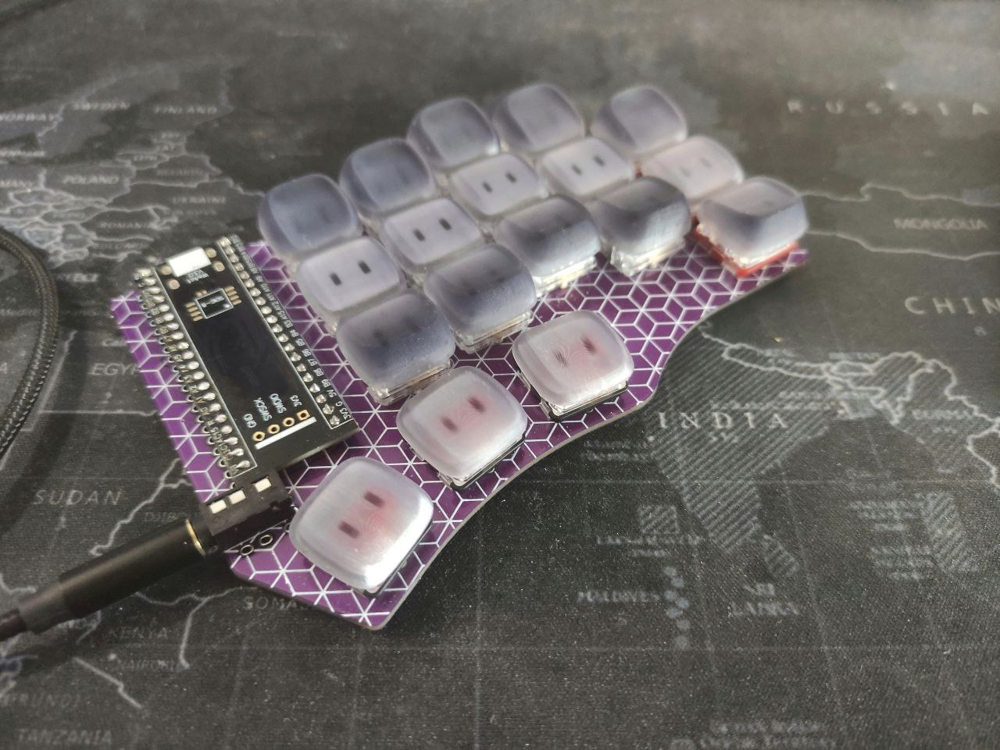
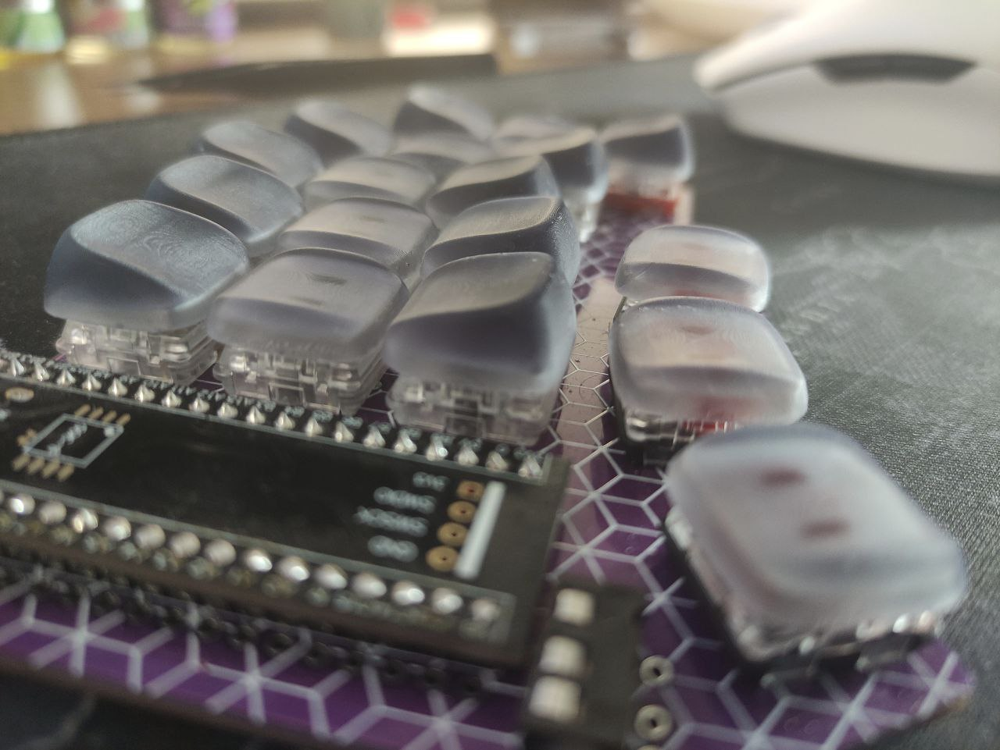
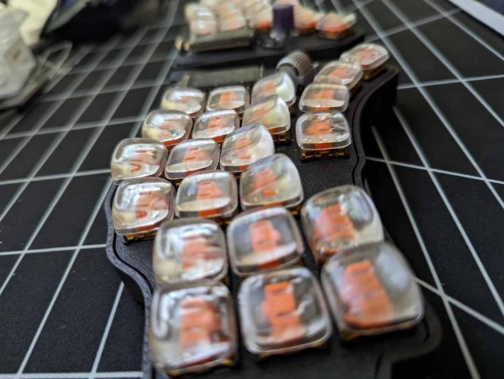
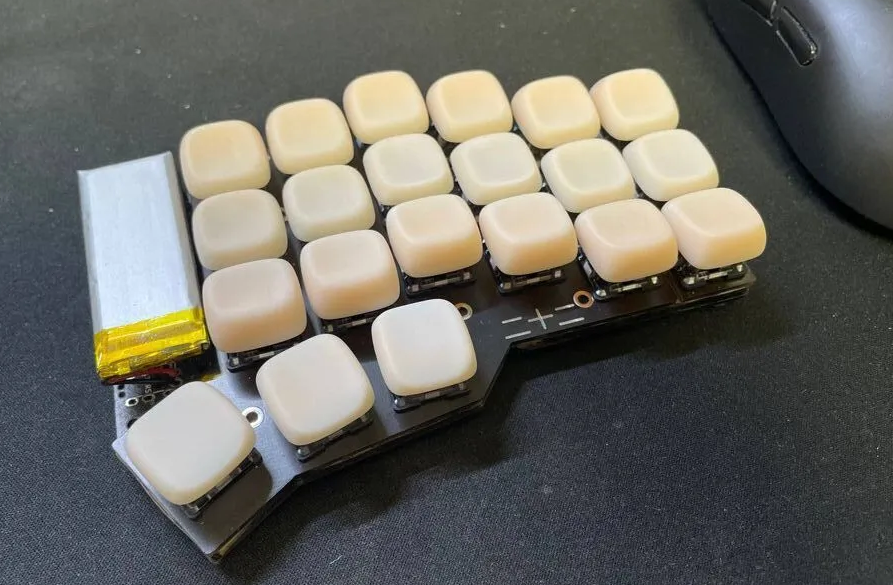
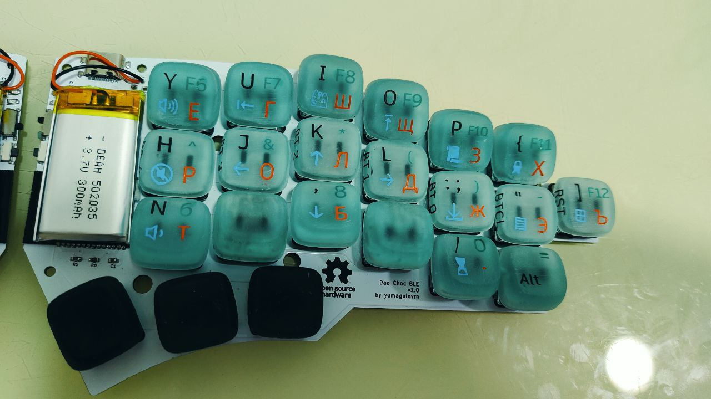

# KLP Lamé — Kailh Choc & MX Keycaps

The repository contains these folders:

- **Fusion 360** – source files for [Autodesk Fusion 360](https://www.autodesk.com/products/fusion-360/overview).
- **STL** – 3D models for any CAD of Slicer software.
- **Lychee** – project files for [Lychee Slicer](https://mango3d.io/). You might need to update model paths to edit files.
- **CTB (Mars 2 Pro)** – print-ready files for [Elegoo Mars 2 Pro](https://www.elegoo.com/collections/mars-series/products/elegoo-mars-2-pro-mono-lcd-3d-printer) and Elegoo water-washable resin.
- **Assets** – images and actual photos of keycaps.
- **Blender** – Blender files for Preview and managing Combined versions.

There are currently seven variants of keycaps:

- **Normal**. Just a flat keycap profile with a small recess, that is soothing for fingers.
- **Normal Tilted**. Same as Normal, but top profile has a 15° tilt and 0.5mm upward height compensation.
- **Normal Homing**. Has three little bumps that is useful to determine home positions.
- **Thumb**. Same as Normal, but top profile has a cut along down side.
- **Saddle**. Same as Thumb, but top profile has two symmetrical cuts.
- **Saddle Tilted**. Tilted version of Saddle. Same 15° and height compensation.
- **Saddle Homing**. Has three little bumps that is useful to determine home positions.

## What keycaps do I need for my keyboard?

First, you should pick Choc or MX stem variant. Then, for keycap set there are some variants that depends entirely of your choice.

For corne-like keyboards with 36-keys I use:

- 20 Saddle Tilted (for top and bottom rows)
- 16 Saddle (10 for home row + 6 for thumbs)

or

- 20 Normal Tilted (for top and bottom rows)
- 10 Normal (for home row)
- 6 Thumb

## How to print?

It is best to position the model more vertically to avoid tactile layer-to-layer bumps.

> Personally, I use 45° or 75° angle, but it's up to you.

There are **Combined** files for Choc and MX verstions that you can use in any 3D-printing service like [JLCPCB](https://3d.jlcpcb.com/3d-printing/stereolithography) or [PCBWay](https://www.pcbway.com/rapid-prototyping/3d-printing/).

### Saddle
`KLP-Lame-Saddle-6ST-3S-Combined` ([Choc](./STL/Choc/Combined/KLP-Lame-Saddle-6ST-3S-Combined.stl) / [MX](./STL/MX/Combined/KLP-Lame-MX-Saddle-6ST-3S-Combined.stl)) that contains:

- 6 × Saddle Tilted
- 3 × Saddle

`KLP-Lame-Saddle-4ST-4S-1SH-Combined` ([Choc](./STL/Choc/Combined/KLP-Lame-Saddle-4ST-4S-1SH-Combined.stl) / [MX](./STL/MX/Combined/KLP-Lame-MX-Saddle-4ST-4S-1SH-Combined.stl)) that contains:

- 4 × Saddle Tilted
- 4 × Saddle
- 1 × Saddle Homing

### Normal

`KLP-Lame-Normal-6NT-3N-Combined` ([Choc](./STL/Choc/Combined/KLP-Lame-Normal-6NT-3N-Combined.stl) / [MX](./STL/MX/Combined/KLP-Lame-MX-Normal-6NT-3N-Combined.stl)) that contains:

- 6 × Normal Tilted
- 3 × Normal

`KLP-Lame-Normal-4NT-3TH-1NH-1N-Combined`: ([Choc](./STL/Choc/Combined/KLP-Lame-Normal-4NT-3TH-1NH-1N-Combined.stl) / [MX](./STL/MX/Combined/KLP-Lame-MX-Normal-4NT-3TH-1NH-1N-Combined.stl)) that contains:

- 4 × Normal Tilted
- 3 × Thumb
- 1 × Normal Homing
- 1 × Normal

> So, for 36 keys you'll need to order each of these files twice (two for each part of split)

## Warning

It's better to use original STL files instead of Lychee project files as it contains my settings for my particular printer. Use them as an example of making supports and tune them to achieve best quality for your setup.

## Can I use these models for a production and sale?

Yes. But you must leave a mention of this repository/author to end users.

## Can I modify, fork, post (or whatever) these models?

Yes. Rules are the same. Give a credit to the author.

## Images & Photos

### Original photos

> The keyboard is [Cantor Remix](https://github.com/nilokr/cantor-remix)

### From various awesome people

By [mmm1808](https://www.reddit.com/user/mmm1808/) from [Reddit](https://www.reddit.com/r/ErgoMechKeyboards/comments/16mktma/klp_lame_in_transparent_resin/)

By [Grigoriy](https://t.me/grygree) from [Telegram/KlavaOrgWork](t.me/klavaorgwork)

By Sergei Murzin from [Telegram/Rafworks](https://t.me/rafworks)

## Contacts

@braindefender almost anywhere
